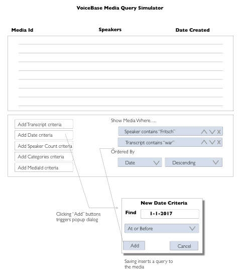

# VoiceBase Media Simulator

Create an app that filters and view a list media from
in calls.json. Your application will make a filter in which
a set of  criteria  are added  ("and" joined by default) 
to reduce the media list displayed. 

For example, clicking the "Add Transcript" should trigger
a dialog box with a search term in it that when confirmed, 
reduces the media to those items whose transcript field includes
that term. 

That criteria should be added as a badge to the blue list 
which should be subsequently removable and sortable. 

On adding a criteria, the media should re-filter with the
additional criteria considered. Use the json file "calls.json"
as the basis for the data store and do all filtering on the client side.

Bonus Points: add an "or" criteria for compound expressions. 

The following criteria should be creatable by your system:

"Find all media created in 2017 with two speakers"

"Find all media whose transcript contains the term "province" 
with a speaker whose name contains "Cremin"

Lastly the bottom badge is a permanant order criteria.
You should be able to order by each field, ascending or descending.

Do all interface with React.js; use create-react-app or 
a similar product to jump-start the project. 

Adjust the Package.json to ensure your work is remotely
runnable. Return the completed project as a zip with no node_modules.

If you have any questions about the scope or execution please email
me - dedelhart@voicebase.com 

It is expected that this project will take 4-6 hours to complete. 
